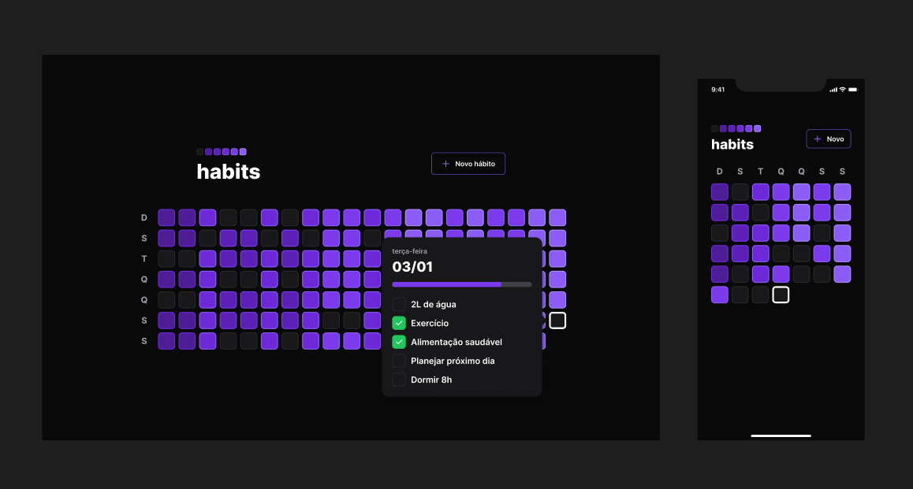

  

## 💻 Projeto

O Habits é um app para ajudar a rastrear os hábitos.

## 🚀 Tecnologias

Esse projeto foi desenvolvido com as seguintes tecnologias:

- HTML e CSS
- JavaScript
- Git e Github
- Figma
- TypeScript 
- React 
- React Native 
- SQLite 
- NativeWind

